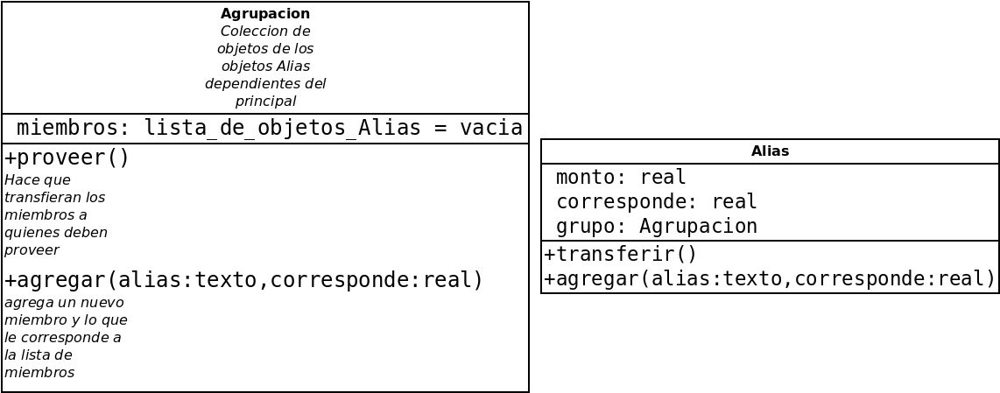

# Nuevo

Una web app con Python y Streamlit para unificar transacciones, se transfiere a un solo alias el total y con lo establecido en cada uno de los alias asignados se transfiere lo que corresponde.

Por Ejemplo, hay un alias A y un alias B se transfiere al alias inicial, como hay una regla que dice que A cobra un tercio y otro alias B dos tercios se transfieren esas fracciones de lo que hay en alias inicial.

Se trata de una billetera virtual para transferencias múltiples con reglas asignadas de que porcentaje del total recibir, perfecto para pagar proveedores, empleados, herederos, instituciones y otros grupos de cuentas a transferir determinado porcentaje con una sola transferencia. Automáticamente se transfiere lo correspondiente al mandar al alias del usuario según como haga y configure los grupos de alias de otros usuarios.
## Diagramas UML y documentacion de interes

## Fecha de inicio
Martes 16/12/2025
### Horarios de desarrollo
Lunes a Viernes de 14:00 a 16:00 (hora de Argentina) 
